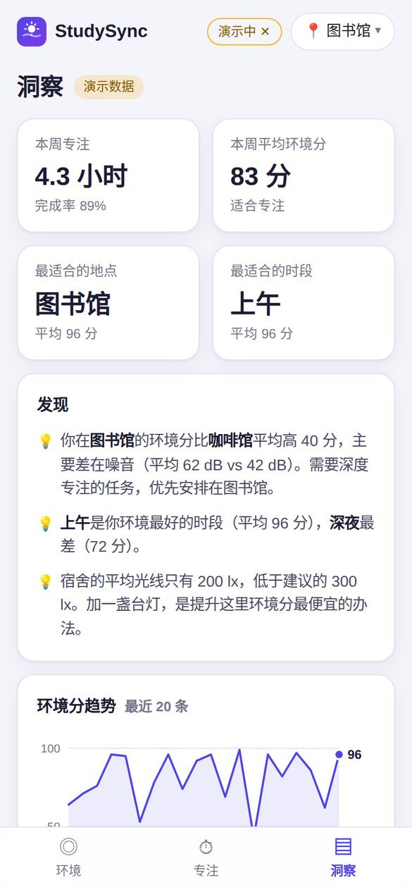

<div align="center">


# StudySync · 学习环境检测

**开始学习前，先看看这里适不适合学习。**

用摄像头和麦克风估算光线与噪音，结合当地天气给学习环境打分；专注时持续监测，环境变差就提醒；并告诉你在哪里、什么时候学得最好。

[**▶ 立即试用**](https://yunruilin99.github.io/studysync-web/app/) · [用演示数据体验](https://yunruilin99.github.io/studysync-web/app/?demo=1) · [产品案例](https://yunruilin99.github.io/studysync-web/) · [English](#english)

| 环境检测 | 专注计时 + 提醒 | 历史洞察 |
| :---: | :---: | :---: |
|  |  |  |


</div>

## 为什么做这个

目标用户是经常在图书馆、宿舍、教室、咖啡馆之间换地方自习的大学生。光线变暗、周围变吵都是慢慢发生的，人很难察觉；"去哪学、什么时候学效率更高"也往往只能凭感觉判断。StudySync 把这些"感觉"变成可解释的分数和具体建议。

## 功能

- **环境评分**：摄像头估算光线（lx），麦克风估算噪音（dB），合成 0–100 的环境分，并考虑短板效应
- **可执行的建议**：告诉用户具体该做什么，比如"打开台灯，桌面照度最好在 300–500 lx"
- **当地天气**：按定位获取天气，并作为建议的上下文；定位被拒绝时可以手动选城市
- **专注计时**：25 / 50 分钟专注，期间持续监测环境并实时画出环境分曲线；环境分连续 20 秒低于 60 分就提醒
- **电脑 / 手机自适应**：电脑上是一屏看全的仪表盘，手机上是底部标签页
- **历史洞察**：按地点、时段统计环境分，找出最适合你的学习地点和时间
- **演示模式**：不授权摄像头和麦克风，也能用模拟数据完整体验
- **隐私友好**：画面和声音只在设备上计算，不录像、不录音、不上传；记录保存在浏览器本地

## 从 v1 到 v2

v1 是 2026 年 4 月的 UCL CASA0015 课程作业，用 Flutter 做的手机 App（代码在 [`lib/`](lib/)，最初提交在课程仓库 [casa0015-mobile-assessment](https://github.com/YunruiLin99/casa0015-mobile-assessment)）。复盘后，我在网页版 v2 里重新定义了需求：

| v1 的做法 | 问题 | v2 的改动 |
| --- | --- | --- |
| 只用亮度判断环境 | 学习环境不止光线 | 加入噪音检测，综合评分 |
| 天气固定显示伦敦，且不参与判断 | 对其他城市的用户没有意义 | 按定位获取天气，并参与生成建议 |
| 建议只有"好 / 中 / 差"一句话 | 用户不知道具体该做什么 | 1–3 条带目标数值的具体建议 |
| 检测是一次性的 | 学习过程中环境会变化 | 专注计时 + 持续监测 + 提醒 |
| 只有流水记录和一条折线 | 数据记了，但没有结论 | 最佳地点 / 时段等洞察 |
| 只有手机界面 | 电脑上宽屏浪费，还要来回切换 | 响应式：电脑上一屏看全，手机上保留标签页 |
| 需要安装 App；API key 写在代码里 | 试用门槛高，有泄露风险 | 网页打开即用；改用免 key 的 Open-Meteo |

需求优先级、评分模型、成功指标和路线图，详见 [产品案例页](https://yunruilin99.github.io/studysync-web/)。

## 评分模型

- **光线分**：300–750 lx 为理想区间（阅读和书写建议照度约 500 lx，参考 EN 12464-1），过暗或过亮都会扣分
- **噪音分**：38 dB 以下为满分（WHO 建议教室背景噪声不超过 35 dB(A)），55 dB 以上扣分明显
- **总分**：两项的平均分，但不超过较低一项 + 15 分（短板效应）
- **局限**：摄像头会自动曝光，麦克风也没有校准，所以读数是估算值，适合判断区间，不能替代专业仪器

实现见 [`app/js/score.js`](app/js/score.js)。

## 技术实现

原生 JavaScript（ES Modules），不依赖任何框架，也不需要构建步骤，部署在 GitHub Pages。

```
index.html            产品案例页
app/                  StudySync 网页版
  js/sensors.js       摄像头测光（Canvas 取样）、麦克风测噪（Web Audio API）、演示模式模拟器
  js/score.js         评分模型与建议规则
  js/weather.js       定位 + Open-Meteo 天气 + 城市搜索
  js/insights.js      历史统计与洞察生成
  js/charts.js        SVG 趋势图和条形图（带悬停提示）
  js/store.js         本地存储与演示数据
  js/main.js          界面、专注计时、提醒
lib/                  v1 Flutter App 源码
docs/                 截图与 v1 演示视频
```

本地运行（摄像头和麦克风需要 `localhost` 或 HTTPS 环境）：

```bash
python3 -m http.server 8000
# 打开 http://localhost:8000/app/
```

运行 v1 Flutter App（需要自己的 [OpenWeatherMap](https://openweathermap.org/api) API key）：

```bash
flutter pub get
flutter run --dart-define=OWM_API_KEY=你的key
```

## 我的角色

独立完成：复盘 v1 并重新定义需求、排定优先级、设计评分模型和成功指标、交互与界面设计；开发中借助 AI 辅助编码，由我把控方案并审校代码。

---

## English

**StudySync** helps students check whether their current spot is good for studying. It uses the camera to estimate light and the microphone to estimate noise, then combines them with local weather into a 0–100 environment score with concrete tips. A focus timer keeps monitoring the environment and alerts you when it degrades, and history insights show where and when you study best. Everything runs in the browser, and no video or audio leaves the device.

- **Try it:** [web app](https://yunruilin99.github.io/studysync-web/app/) · [demo mode](https://yunruilin99.github.io/studysync-web/app/?demo=1) (no permissions needed)
- **v1:** a Flutter mobile app built for UCL CASA0015 (April 2026), in [`lib/`](lib/)
- **v2:** a rebuilt web version adding noise detection, weakest-link scoring, location-based weather, a monitored focus timer and history insights
- **Stack:** vanilla JS (ES modules), getUserMedia, Web Audio API, Canvas, Geolocation, Open-Meteo, SVG charts, GitHub Pages

**Author:** Yunrui Lin
