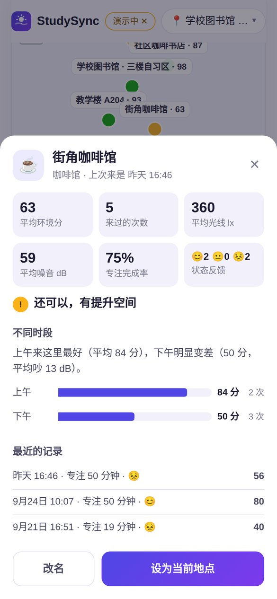

<div align="center">


# StudySync · 学习环境检测

**开始学习前，先看看这里适不适合学习。**

用摄像头和麦克风估算光线与噪音，结合当地天气给学习环境打分；专注时持续监测，环境变差就提醒；并告诉你在哪里、什么时候学得最好。

[**▶ 立即试用**](https://yunruilin99.github.io/studysync-web/app/) · [用演示数据体验](https://yunruilin99.github.io/studysync-web/app/?demo=1) · [产品案例](https://yunruilin99.github.io/studysync-web/) · [English](#english)

| 环境检测 | 专注计时 + 提醒 | 地点档案 | 历史洞察 |
| :---: | :---: | :---: | :---: |
|  |  |  |  |

</div>

## 为什么做这个

目标用户是经常在图书馆、宿舍、教室、咖啡馆之间换地方自习的大学生。光线变暗、周围变吵都是慢慢发生的，人很难察觉；"去哪学、什么时候学效率更高"也往往只能凭感觉判断。StudySync 把这些"感觉"变成可解释的分数和具体建议。

## 功能

- **环境评分**：摄像头估算光线（lx），麦克风估算噪音（dB），合成 0–100 的环境分，并考虑短板效应
- **可执行的建议**：告诉用户具体该做什么，比如"打开台灯，桌面照度最好在 300–500 lx"
- **当地天气**：按定位获取天气，并作为建议的上下文；定位被拒绝时可以手动选城市
- **专注计时**：25 / 50 分钟专注，期间持续监测环境；环境分连续 20 秒低于 60 分就提醒
- **地点档案 + 自习地图**：用定位识别附近的具体地点（比如某一家咖啡店），记住每个地方在不同时段的表现，并在地图上按环境分着色
- **个性化评分**：专注结束后一键反馈状态（😣 / 😐 / 😊），积累 5 次以上就学习你适合的噪音水平，按你的偏好调整评分
- **历史洞察**：按地点、时段统计环境分，找出最适合你的学习地点和时间，比如"同样是咖啡馆，A 比 B 平均高 24 分"
- **演示模式**：不授权摄像头和麦克风，也能用模拟数据完整体验
- **隐私友好**：画面和声音只在设备上计算，不录像、不录音、不上传；记录保存在浏览器本地

## 需求取舍

- **P0**：噪音检测 + 综合环境分、按定位获取天气、可执行的具体建议、演示模式
- **P1**：专注计时 + 环境变差提醒、历史洞察、地点档案 + 自习地图、状态反馈 + 个性化评分
- **明确不做**：把室外温度算进分数（室外不等于室内，会误导用户）、账号和云同步（环境数据敏感）、排行榜（和"专注"目标冲突）

评分模型、成功指标和路线图，详见 [产品案例页](https://yunruilin99.github.io/studysync-web/)。

## 评分模型

- **光线分**：300–750 lx 为理想区间（阅读和书写建议照度约 500 lx，参考 EN 12464-1），过暗或过亮都会扣分
- **噪音分**：38 dB 以下为满分（WHO 建议教室背景噪声不超过 35 dB(A)），55 dB 以上扣分明显
- **总分**：两项的平均分，但不超过较低一项 + 15 分（短板效应）
- **个性化**：用"状态好"那几次专注的噪音水平平移噪音曲线（见 [`app/js/personal.js`](app/js/personal.js)）。有研究发现适度背景声有助于创造性任务（Mehta 等，2012），所以最佳噪音因人而异
- **局限**：摄像头会自动曝光，麦克风也没有校准，所以读数是估算值，适合判断区间，不能替代专业仪器

实现见 [`app/js/score.js`](app/js/score.js)。

## 技术实现

原生 JavaScript（ES Modules），不需要构建步骤，部署在 GitHub Pages。地图用 Leaflet + OpenStreetMap，地点识别用 Overpass API，天气用 Open-Meteo，全部免费、无需 API key。

```
index.html            产品案例页
app/                  StudySync 网页版
  js/sensors.js       摄像头测光（Canvas 取样）、麦克风测噪（Web Audio API）、演示模式模拟器
  js/score.js         评分模型与建议规则
  js/weather.js       定位 + Open-Meteo 天气 + 城市搜索
  js/insights.js      历史统计、地点档案与洞察生成
  js/places.js        附近地点识别（OpenStreetMap Overpass）
  js/personal.js      状态反馈 → 个性化噪音评分
  js/charts.js        SVG 趋势图和条形图（带悬停提示）
  js/store.js         本地存储与演示数据
  js/main.js          界面、专注计时、提醒
docs/                 截图
```

本地运行（摄像头和麦克风需要 `localhost` 或 HTTPS 环境）：

```bash
python3 -m http.server 8000
# 打开 http://localhost:8000/app/
```

## 我的角色

独立完成：定义用户和需求、排定优先级、设计评分模型和成功指标、交互与界面设计；开发中借助 AI 辅助编码，由我把控方案并审校代码。

---

## English

**StudySync** helps students check whether their current spot is good for studying. It uses the camera to estimate light and the microphone to estimate noise, then combines them with local weather into a 0–100 environment score with concrete tips. A focus timer keeps monitoring the environment and alerts you when it degrades, and history insights show where and when you study best. Everything runs in the browser, and no video or audio leaves the device.

- **Try it:** [web app](https://yunruilin99.github.io/studysync-web/app/) · [demo mode](https://yunruilin99.github.io/studysync-web/app/?demo=1) (no permissions needed)
- **Features:** light + noise scoring with a weakest-link rule, actionable tips, location-based weather, a monitored focus timer, place profiles for specific spots (e.g. a particular café) with a personal study map, personalised noise scoring learned from post-session feedback, and history insights
- **Stack:** vanilla JS (ES modules), getUserMedia, Web Audio API, Canvas, Geolocation, Open-Meteo, OpenStreetMap/Overpass, Leaflet, SVG charts, GitHub Pages

**Author:** Yunrui Lin
